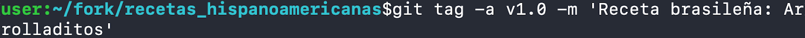
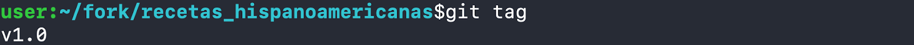
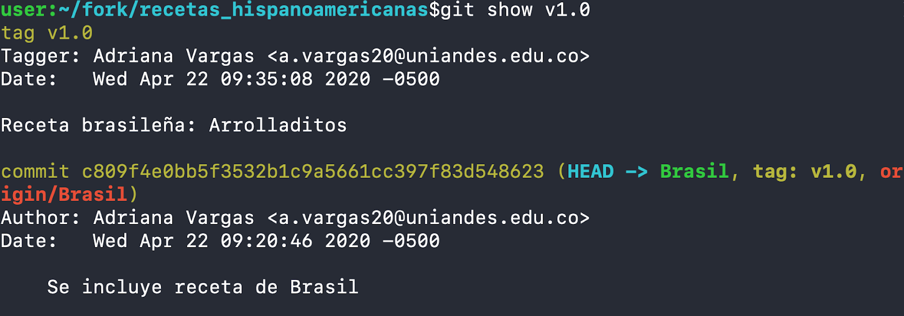
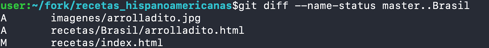
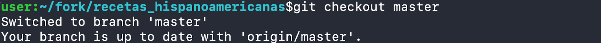
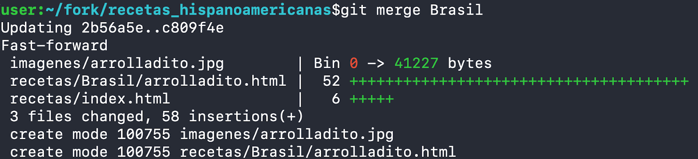

# Tutorial Git: Recetas Hispanoamericanas (Secciones 6 a 9)

## 6. Crear y extraer etiquetas

### 6.1 Crear una etiqueta anotada
Ejecute el siguiente comando para registrar una etiqueta con mensaje y autor en el último commit:

```bash
git tag -a v1.0 -m "Receta brasileña: Arrolladitos"
```



### 6.2 Listar etiquetas disponibles
Para confirmar qué etiquetas existen actualmente:

```bash
git tag
```



### 6.3 Consultar información de la etiqueta
Revise la metadata y los cambios asociados a `v1.0` con:

```bash
git show v1.0
```



Este comando muestra autor, fecha, commit apuntado y una vista previa del diff incluido en la etiqueta.

### 6.4 Eliminar una etiqueta local
Si necesita borrar la etiqueta `v1.0`, utilice:

```bash
git tag -d v1.0
```


## 7. Comparar ramas

La comparación entre ramas permite estudiar qué archivos se han agregado, modificado o eliminado en un flujo de trabajo colaborativo. Use el siguiente resumen según la información que necesite:

| Objetivo | Comando | Descripción |
| --- | --- | --- |
| Ver archivos y su estado | `git diff --name-status master..Brasil` | Muestra solo los nombres y el tipo de cambio (A, M, D). |
| Revisar el contenido modificado | `git diff master..Brasil` | Incluye el diff completo línea a línea. |
| Obtener estadísticas resumidas | `git diff --stat master..Brasil` | Indica cuántos archivos cambiaron y cuántas líneas se agregaron o eliminaron. |



En la captura se observa cómo los archivos marcados con `A` corresponden a nuevos documentos y los marcados con `M` a modificaciones existentes.


## 8. Mezclar ramas

Integre los cambios de la rama `Brasil` en `master` siguiendo estos pasos:

1. Cambie a la rama principal:

	```bash
	git checkout master
	```

	

2. Fusione la rama de trabajo:

	```bash
	git merge Brasil
	```

	

Tras ejecutar ambos comandos tendrá una fusión limpia; más adelante se simulará un caso con conflictos para practicar su resolución.


## 9. Conflictos de fusión

Los conflictos aparecen cuando dos ramas editan simultáneamente el mismo archivo o bloque de código. En este taller se reproducirá el trabajo paralelo de dos desarrolladores: uno en `master` y otro en `Colombia`. Cada uno agregará una receta y modificará el `index`, provocando un conflicto que deberá resolverse manualmente antes de completar la integración.

Antes de empezar, abra dos terminales o consolas de Git Bash, asegúrese que cada una esté en una ubicación diferente y que tenga el repositorio del proyecto clonado.

Personalice su identidad en cada una de las terminales teniendo en cuenta el material proporcionado en lecciones pasadas. Si no lo tiene a la mano, ejecute:

## Para el desarrollador 1:

`git config user.name "desarrollador_1"`
`git config user.email desarrollador_1@uniandes.edu.co`

## Para el desarrollador 2:

`git config user.name "desarrollador_2"`
`git config user.email desarrollador_2@uniandes.edu.co`

## Ahora, siga los siguientes pasos para el desarrollador 1:

Ubíquese en la rama Colombia.